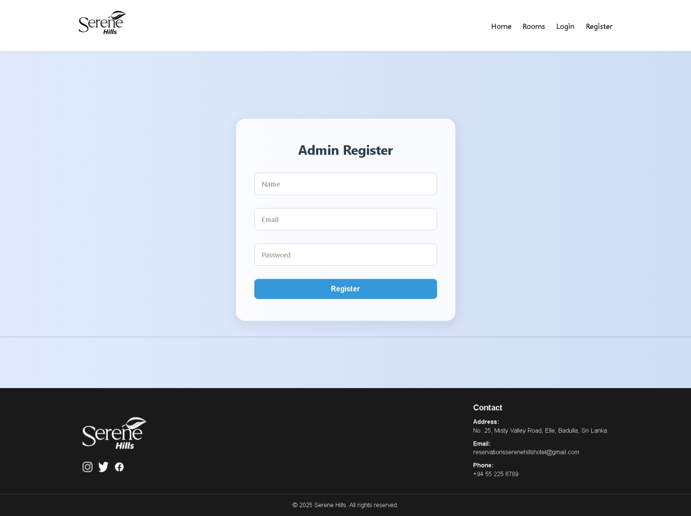
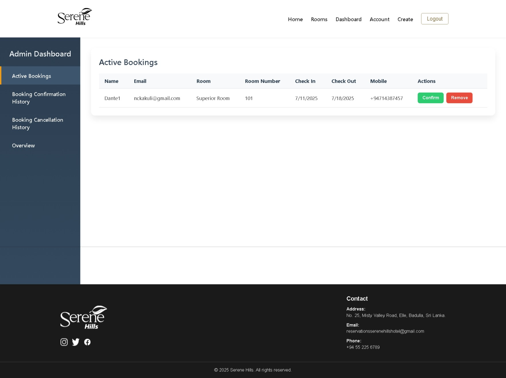
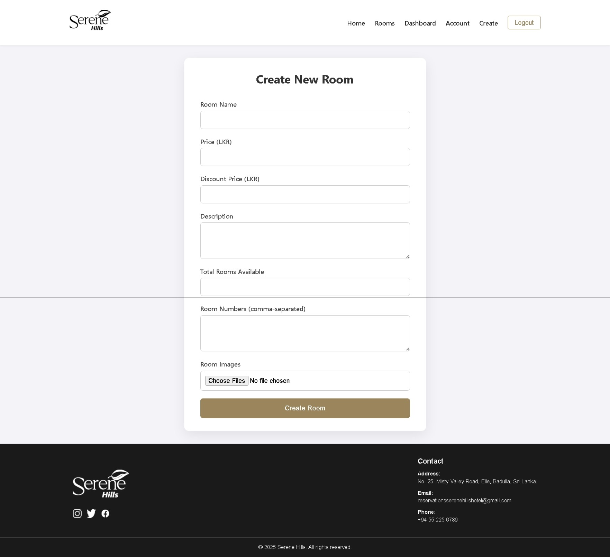
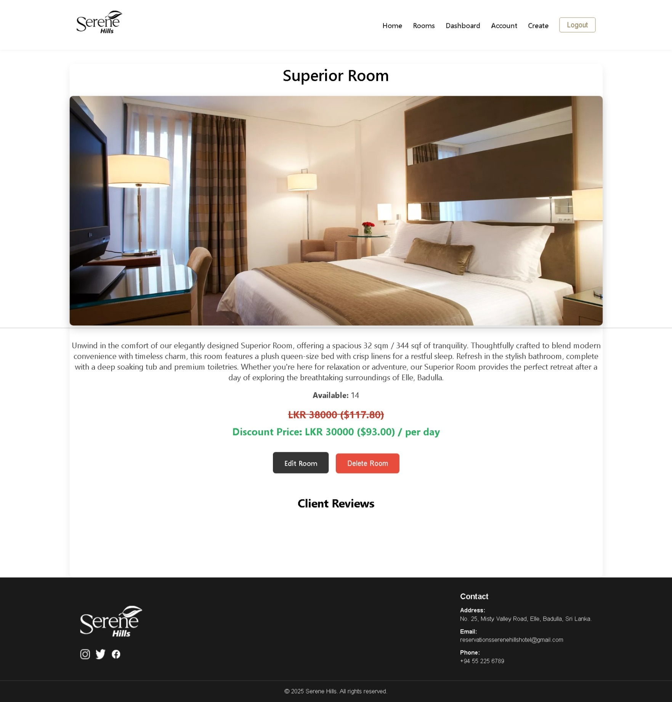
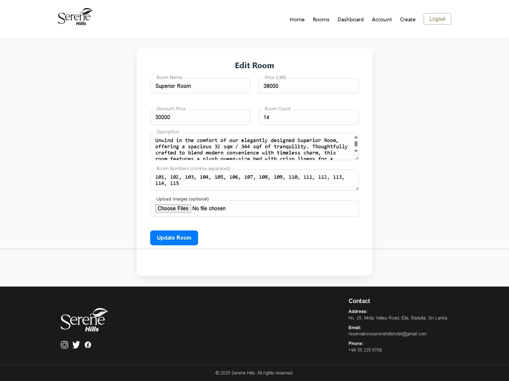
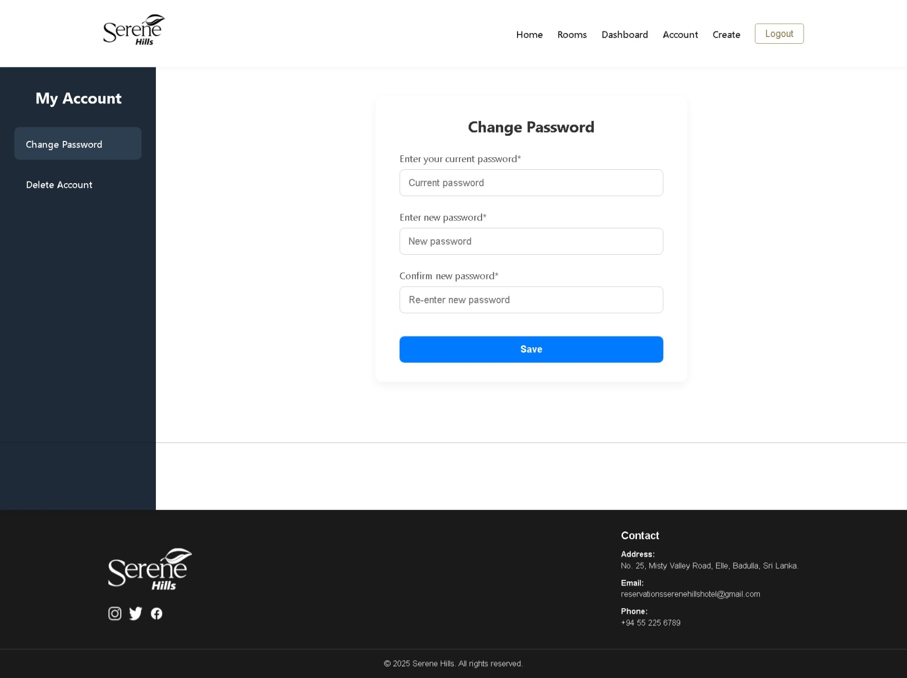

# Serene Hills Hotel – MERN Stack Hotel Room Reservation Website

A full-stack hotel room reservation system built with the MERN stack. This project allows users to view room availability, make bookings, and manage hotel room reservations, with a separate admin dashboard for hotel staff.

---

## 🚀 Features

- Customer-facing frontend to browse and book rooms
- Admin dashboard for managing rooms, bookings and room details
- Authentication with JWT
- MongoDB database integration
- Email notification setup
- Image uploads via Cloudinary

---

## 🛠 Installation Guide

### 1. Clone the Repository

```bash
git clone https://github.com/niroshachandimal/MERN-Stack-Hotel-Room-Reservation-Website.git
cd MERN-Stack-Hotel-Room-Reservation-Website-main
```

---

### 2. Install Dependencies

```bash
# Install server dependencies
cd MERN-Stack-Hotel-Room-Reservation-Website-main
npm install

# Install admin dependencies
cd admin
npm install

# Install client dependencies
cd client
npm install
```

### 3. Configure Environment Variables

Create a `.env` file in the root of each necessary folder using the following structure:

#### In the main project folder (`MERN-Stack-Hotel-Room-Reservation-Website-main`):

```
.env
MONGO_URI=mongodb://localhost/ytbooking
JWT_SECRET=[YOUR_SECRET_KEY]
EMAIL_USER=[YOUR_EMAIL_ADDRESS]
EMAIL_PASS=[YOUR_EMAIL_APP_GENERATED_PASSWORD]
```

#### In the `admin` folder:

```
.env
REACT_APP_CLOUD_NAME=[YOUR_CLOUDINARY_NAME]
REACT_APP_UPLOAD_PRESET=[YOUR_CLOUDINARY_PRESET]
PORT=3001
```

---

## 📦 Running the Project Locally

From the root folder:

```bash
# Start the admin frontend
npm run dev-admin

# Start the client frontend
npm run dev-client
```
## 🌐 Project Interfaces

### 🔒 Admin Side









### 👤 Client Side


---

## 🧾 License

This project is licensed under the MIT License.  
Feel free to use and modify as needed.

---

## 🙋‍♂️ Author

**Nirosha Chandimal**  
[GitHub Profile](https://github.com/niroshachandimal)
